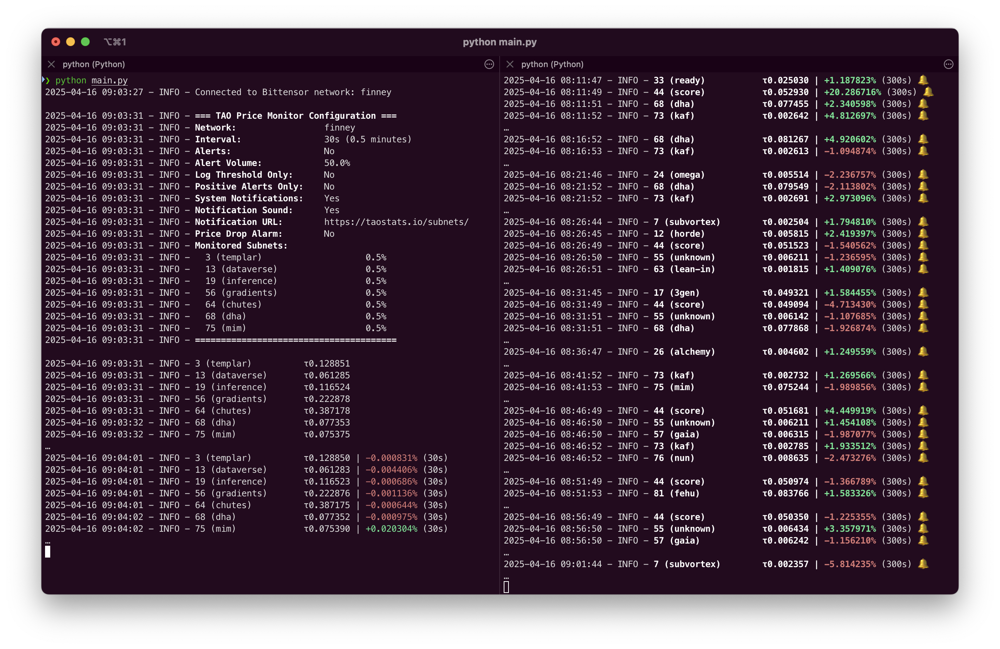

# dTAO Monitor

**dTAO Monitor** is a tool for monitoring Bittensor's subnet token prices, providing real-time insights and configurable tracking with optional alert sounds 🔔



## Features

### Price Monitoring
- Real-time monitoring of subnet token prices
- Configurable monitoring intervals
- Customizable price change thresholds
- Detailed logging with color-coded output

### Alerts
- Sound alerts for significant price changes
- System notifications (macOS only) linking to [taostats.io](https://taostats.io/) subnet pages
- Configurable alert sounds and volumes
- Optional positive-only alerts

### Price Drop Alarm
- Monitors for significant price drops from initial values
- Configurable drop threshold (default 10%)
- Customizable alarm sound
- Initial prices are recorded when the monitor starts

## Project Structure

```
.
├── main.py              # Main entry point
├── config.yaml          # Configuration file
├── requirements.txt     # Python dependencies
└── src/                 # Source code package
    ├── __init__.py
    ├── config.py          # Configuration management
    ├── logger.py          # Logging utilities
    ├── alert_manager.py   # Sound alert management
    ├── price_monitor.py   # Core monitoring logic
    └── price_alarm.py     # Price drop alarm system
```

## Installation Instructions

### **1. Ensure Python 3.12 is Installed**
Bittensor requires Python **3.12** for proper functionality.
Check your Python version:
```sh
python3 --version
```
If Python 3.12 is not installed, install it via [Python.org](https://www.python.org/downloads/) or using Homebrew on macOS:
```sh
brew install python@3.12
```

### **2. Create a Virtual Environment**
Create a new virtual environment using Python 3.12:
```sh
python3.12 -m venv venv
```
Activate the virtual environment:
```sh
source venv/bin/activate
```

### **3. Install Dependencies**
Once the virtual environment is activated, install required dependencies:
```sh
pip install -r requirements.txt
```

### **4. Modify Configuration**
Customize the `config.yaml` file according to your preferences before running the monitor.

#### **Example Configuration Structure**
The configuration file allows you to specify network settings, monitoring intervals, and alert sounds.
Here is an example of the structure:

```yaml
network: "finney"
interval: 300  # seconds
threshold: 1.  # default percent change

# Alert settings
alerts_on: true
alert_positive: "sounds/yeah.mp3"
alert_negative: "sounds/wtf.mp3"
alert_volume: 0.5  # 0.0 to 1.0

# Price drop alarm settings
alarm_enabled: true  # Enable price drop alarm
alarm_threshold: 10.0  # Trigger alarm at 10% drop
alarm_sound: "sounds/alarm.mp3"  # Sound file for alarm
alarm_volume: 1.0  # 0.0 to 1.0

# List of subnets to monitor
subnets:
  - netuid: 13
  - netuid: 19
  - netuid: 34
  - netuid: 52
    threshold: 1.5  # subnet percent change
  - netuid: 68
    threshold: .5
```

- **`network`**: Specifies the network to connect to (e.g., "finney").
- **`interval`**: Time in seconds between monitoring checks.
- **`threshold`**: Default percent change threshold for all subnets.
- **`alerts_on`**: Enables or disables alert sounds.
- **`alert_positive` / `alert_negative`**: Audio alerts triggered based on monitoring results.
- **`alert_volume`**: Volume level for sound alerts (0.0 to 1.0).
- **`alarm_enabled`**: Enables or disables the price drop alarm.
- **`alarm_threshold`**: Percentage drop from initial price to trigger alarm.
- **`alarm_sound`**: Sound file to play when price drop alarm is triggered.
- **`alarm_volume`**: Volume level for alarm sound (0.0 to 1.0).
- **`subnets`**: List of subnets to monitor, each identified by `netuid` and optional subnet-specific `threshold` to override default.

### **5. Run dTAO Monitor**
Start the monitor using the following command:
```sh
python main.py
```

You can also specify a custom configuration file:
```sh
python main.py --config custom_config.yaml
```

## **License**
This project is licensed under the MIT License.

## **Contributions**
Contributions and improvements are welcome! Feel free to submit a pull request or open an issue.

---
Developed with ❤️ for the Bittensor community.

